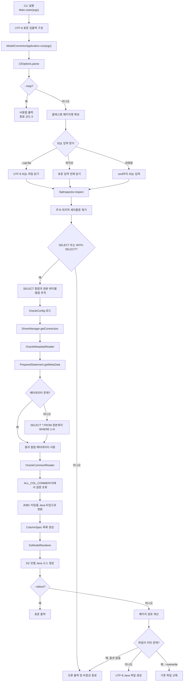

# ModelConvertor 프로젝트 처리 흐름

## 개요

ModelConvertor는 SQL을 입력받아 Oracle JDBC 결과 메타데이터와 컬럼 설명을 조회하고, 이를 DZ 모델 Java 소스로 변환하는 CLI 도구다.

전체 흐름은 다음과 같다.

```text
CLI 입력 → SQL 분석 → Oracle 연결 → 결과 메타데이터 조회
        → Java 타입 결정 → DZ 모델 렌더링 → 파일 또는 stdout 출력
```

실제 조회 결과 행은 사용하지 않는다. 우선 `PreparedStatement.getMetaData()`로 결과 구조를 확인하고, 드라이버가 메타데이터를 제공하지 않을 때만 원본 SQL을 `WHERE 1 = 0` 쿼리로 감싸 메타데이터를 얻는다.

## 전체 플로우 차트



## 단계별 처리

### 1. 애플리케이션 시작

`Main`은 표준 입력, 표준 출력, 표준 오류를 UTF-8로 구성한 후 `ModelConvertorApplication`을 실행한다. 현재 입력이 터미널인지도 함께 전달하여 대화형 입력과 파이프 입력을 구분한다.

```text
Main.main(args)
└─ Main.run(args)
   └─ ModelConvertorApplication.run(args)
```

### 2. CLI 옵션 해석

`CliOptions`가 다음 옵션을 처리한다.

| 옵션 | 의미 |
|---|---|
| `--sql-file <path>` | SQL을 읽을 UTF-8 파일 |
| `--class-name <name>` | 생성할 Java 클래스명 |
| `--package <name>` | 생성할 Java 패키지명 |
| `--output <path>` | 소스 출력 루트 |
| `--config <path>` | Oracle 설정 파일 경로 |
| `--overwrite` | 기존 출력 파일 교체 허용 |
| `--stdout` | 파일 대신 표준 출력 사용 |
| `--help` | 사용법 출력 |

파이프 입력에서는 `--class-name`과 `--package`가 필수다. 터미널에서 직접 실행할 경우 누락된 값은 대화형으로 입력받는다.

### 3. SQL 입력

`SqlInput`은 다음 우선순위로 SQL을 읽는다.

1. `--sql-file`이 있으면 지정된 파일을 UTF-8로 읽는다.
2. 터미널 입력이면 한 줄에 `:end`가 입력될 때까지 읽는다.
3. 파이프 입력이면 EOF까지 표준 입력을 읽는다.

### 4. SQL 검사 및 원본 컬럼 추적

`SqlInspector`는 SQL을 다음과 같이 처리한다.

- 문자열 리터럴을 보존하면서 블록 주석과 한 줄 주석을 제거한다.
- 마지막 세미콜론 하나를 제거한다.
- 여러 SQL 문 입력을 거부한다.
- 최상위 문장이 `SELECT` 또는 `WITH ... SELECT`인지 검사한다.
- 최상위 `SELECT` 목록과 `FROM` 절을 찾는다.
- `FROM` 및 `JOIN`의 테이블 별칭을 분석한다.
- `별칭.컬럼` 형태의 직접 컬럼만 원본 테이블·컬럼과 연결한다.

계산식, 함수 호출 등 원본 컬럼을 하나로 확정할 수 없는 결과 항목에는 임의의 컬럼 설명을 적용하지 않는다.

### 5. Oracle 설정과 연결

`OracleConfig`는 기본적으로 다음 파일을 읽는다.

```text
C:\Douzone\dews-web\config\modelconvertor\oracle.properties
```

설정 예시는 다음과 같다.

```properties
oracle.url=jdbc:oracle:thin:@127.0.0.1:1521/ORCL
oracle.username=MY_USER
oracle.password=MY_PASSWORD
oracle.schema=MY_SCHEMA
```

`--config` 옵션을 사용하면 다른 설정 파일을 지정할 수 있다. 설정을 읽은 후 다음 코드로 Oracle 연결을 생성한다.

```java
DriverManager.getConnection(config.url(), config.username(), config.password())
```

연결은 try-with-resources 범위 안에서 사용되므로 메타데이터 처리가 끝나면 자동으로 닫힌다.

### 6. 결과 메타데이터 조회

`OracleMetadataReader`는 우선 원본 SQL로 `PreparedStatement`를 만들고 다음 API를 호출한다.

```java
statement.getMetaData()
```

메타데이터가 반환되면 SQL을 실행하지 않는다. 드라이버가 `null`을 반환하는 경우에만 다음 형태의 쿼리를 실행한다.

```sql
SELECT *
  FROM (
       -- 원본 SQL
  )
 WHERE 1 = 0
```

`WHERE 1 = 0`이므로 결과 행은 반환되지 않으며 `ResultSetMetaData`만 사용한다.

수집하는 정보는 다음과 같다.

- 결과 컬럼 순서
- 결과 컬럼 라벨
- JDBC 타입
- precision과 scale
- Oracle 타입명

결과 라벨 또는 변환된 Java 필드명이 중복되면 생성을 중단하고 `AS` 별칭 사용을 안내한다.

### 7. Oracle 컬럼 설명 조회

`OracleCommentReader`는 `SqlInspector`가 직접 원본 컬럼으로 판별한 항목만 다음 뷰에서 조회한다.

```sql
SELECT COMMENTS
  FROM ALL_COL_COMMENTS
 WHERE OWNER = ?
   AND TABLE_NAME = ?
   AND COLUMN_NAME = ?
```

SQL에 owner가 명시되지 않았다면 `oracle.schema` 값을 사용한다. 설명이 없으면 빈 문자열을 사용한다.

### 8. Java 타입 결정

`JdbcTypeMapper`가 JDBC 결과 타입을 DZ 모델 필드 타입으로 변환한다.

대표적인 매핑은 다음과 같다.

| Oracle/JDBC 계열 | Java 타입 |
|---|---|
| 문자, CLOB | `String` |
| 작은 정수형 NUMBER | `Integer` |
| 큰 정수형 NUMBER | `Long` |
| 소수 또는 큰 NUMBER | `BigDecimal` |
| FLOAT, BINARY_FLOAT, BINARY_DOUBLE | `Double` |
| DATE, TIMESTAMP | `LocalDateTime` |
| 알 수 없는 타입 | `String` |

### 9. DZ 모델 소스 생성

`DzModelRenderer`는 `ColumnSpec` 목록으로 다음 요소를 생성한다.

- package 선언
- DZ 및 Gson import
- 필요한 경우 `BigDecimal`, `LocalDateTime` import
- `@DzModel`
- `@SerializedName`
- `@DzModelField`
- Java 필드
- getter와 setter

결과 컬럼 라벨은 애너테이션 값에 그대로 보존하고, Java 필드명만 유효한 camelCase 식별자로 변환한다.

### 10. 결과 출력

`SourceOutput`은 `--stdout` 여부에 따라 출력 방식을 결정한다.

#### 파일 출력

기본 경로는 다음과 같다.

```text
{현재 디렉터리}/src/main/java/{패키지 경로}/{클래스명}.java
```

필요한 상위 디렉터리를 자동 생성하고 UTF-8로 기록한다. 기존 파일이 있으면 기본적으로 실패하며 `--overwrite`가 있을 때만 교체한다.

#### 표준 출력

`--stdout`이 있으면 파일을 만들지 않고 생성된 Java 소스만 표준 출력으로 내보낸다.

## 오류 처리와 종료 코드

| 종료 코드 | 의미 |
|---|---|
| `0` | 정상 처리 또는 `--help` 출력 |
| `1` | 파일 충돌, Oracle 연결, JDBC 또는 기타 처리 실패 |
| `2` | 잘못된 옵션, SQL, 클래스명 또는 패키지명 |

DB 처리 중 예외가 발생하면 사용자에게는 `Processing failed`를 출력한다. Oracle 비밀번호나 상세 연결 정보는 오류 메시지에 포함하지 않는다.

## 주요 클래스 책임

| 클래스 | 책임 |
|---|---|
| `Main` | UTF-8 프로세스 입출력과 종료 코드 처리 |
| `ModelConvertorApplication` | 전체 처리 순서 조율 |
| `CliOptions` | CLI 옵션 해석 |
| `SqlInput` | 파일, 파이프, 대화형 SQL 입력 |
| `SqlInspector` | SQL 검증과 직접 원본 컬럼 추적 |
| `OracleConfig` | Oracle 접속 설정 로드 |
| `OracleMetadataReader` | JDBC 결과 컬럼 메타데이터 조회 |
| `OracleCommentReader` | Oracle 컬럼 설명 조회 |
| `JdbcTypeMapper` | JDBC 타입을 Java 타입으로 변환 |
| `JavaNames` | 결과 라벨을 Java 필드명으로 변환 |
| `ColumnSpec` | 모델 필드 생성에 필요한 정보 보관 |
| `DzModelRenderer` | DZ 모델 Java 소스 렌더링 |
| `SourceOutput` | stdout 또는 UTF-8 파일 출력 |
